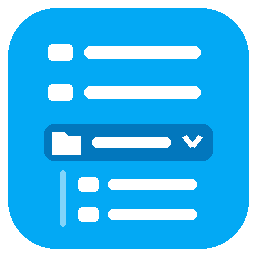

# Easy Sidebar Pro

Collapsible groups for the Home Assistant sidebar, edited right inside the sidebar with drag and drop.
Hebrew and English, right-to-left aware.

## What it does

- **Groups**: a header row with an icon and a name. Click it to fold or unfold. A folded group that
  holds the page you are on is highlighted, so you always know where you are.
- **Edit in place**: press the pencil next to the sidebar title. Every row gets a drag handle.
  - Drop a row **onto** another row to create a group with both. Type the name right away.
  - Drop a row onto a group header to add it to that group.
  - Drop between rows to move. Whole groups move by their handle.
  - The eye button hides or shows a panel (the same hidden list Home Assistant uses).
  - Group icon and name are edited on the group row; "ungroup" puts its panels back in place.
  - **Done** saves (with nothing changed it just closes), **Cancel** throws the changes away.
- **Your layout follows you**: it is stored in Home Assistant per user, not in the browser, so it is
  the same on every computer, tablet and in the companion app.
- **Admin default**: an admin can press "Set as default for everyone". Users who never edited their
  sidebar get that layout; anyone can go back to it with "Reset to the default layout". These actions
  ask for confirmation inside the editor first. A user on the default who only hides or shows panels
  keeps following it (only Home Assistant's hidden list is written); any other saved change tells them
  once that the layout becomes their own.
- **Works with Home Assistant's own sidebar settings**: order and hidden panels are written to Home
  Assistant's own sidebar settings too. Its long-press "Edit sidebar" dialog keeps working: hiding
  works as before, and a new order saved there is applied to your layout (groups stay; panels inside
  each group follow the new order). If you were following the admin default, a short message tells you the
  layout is now your own, with Undo.
- **Start over**: without an admin default, "Remove groups and custom order" in the editor brings back
  Home Assistant's own sidebar (hidden panels stay hidden).
- **No flicker**: groups are drawn as part of Home Assistant's own sidebar, not patched in afterwards.
- **Touch and keyboard**: drag with a finger or a mouse. With the keyboard, focus a handle and press
  Alt + Up / Down; a screen reader hears where the row landed.

## Install

1. HACS → three dots → Custom repositories → `https://github.com/bareli/easy_sidebar_pro`, type
   **Integration**.
2. Download **Easy Sidebar Pro**, restart Home Assistant.
3. Settings → Devices & services → Add integration → **Easy Sidebar Pro**.
4. Refresh the browser (and close and reopen the companion app). The pencil appears next to the
   sidebar title.

No `configuration.yaml` changes are needed.

## Requirements and compatibility

- Home Assistant 2026.9 or newer (the sidebar was rebuilt in 2026; older versions are not tested).
- Do not use it together with another sidebar plugin that changes the panel list (for example
  Sidebar Organizer): both change the same sidebar and the result is unpredictable.
- If a future Home Assistant release changes the sidebar internals, Easy Sidebar Pro switches itself
  off and the normal sidebar stays. Your layout is kept.

## Removing

Delete the integration and refresh the browser. Home Assistant's own order and hidden panels stay as
you last saved them.

## Development

- Python tests: `pytest` (pytest-homeassistant-custom-component).
- JavaScript tests: `npm test` (Node 20+, no dependencies).
- See `SPEC.md` for the design.

## License

MIT
